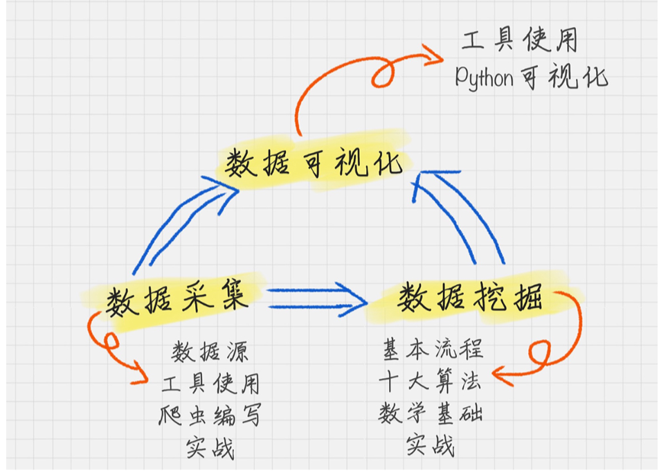
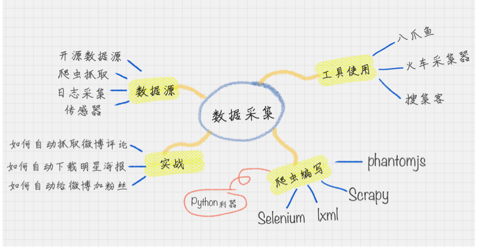
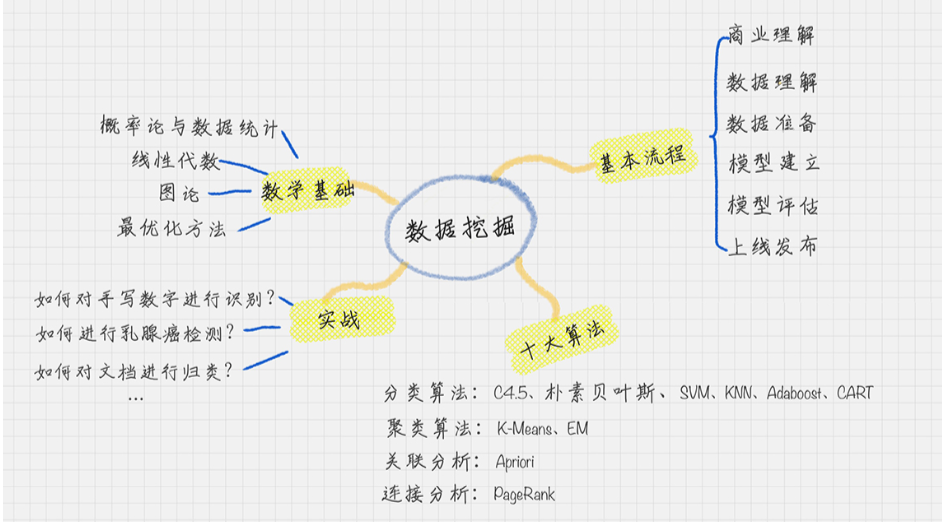
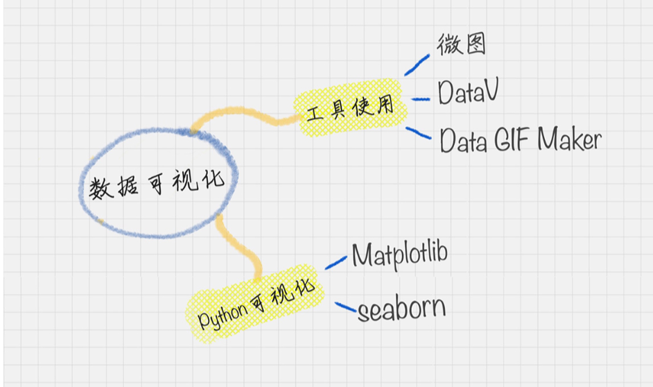

# 数据分析

培养数据思维，掌握挖掘工具，熟练实践并积累经验

> 业务洞察是分析数据的前提，分析数据是理解数据的前提，理解数据是数据挖掘的前提。

## 书籍

- 思维 
  - 《思维简史：从丛林到宇宙》
- 统计学
  - 《统计学》
  - 《统计学习方法》
- 数学
  - 《线性代数》
  - 《概率论与数理统计》
- 数据处理
  - 《数据挖掘：概念与技术》
  - 《Pentaho Kettle 解决方案》
  - 《精益数据分析》
  - 《Small Data》 
  - 《利用 Python 进行数据分析》
- 商业
  - 《洛克菲勒留给儿子的 38 封信》
  - 《商业冒险：华尔街的 12 个经典故事》
  - 《从 0 到 1:开启商业与未来的秘密》
  - 《商业的本质》

## 数据分析全景图及修炼指南

### 数据分析的组成

- 数据采集
  “接地气”，任何分析都要有数据源
- 数据挖掘
  “高大上”，也是整个商业价值所在，之所以要进行数据分析，就是要找到其中的规律，来指导我们的业务。因此**数据挖掘的核心是挖掘数据的商业价值，也就是我们所谈的商业智能 BI**
- 数据可视化
  万金油，直观了解数据分析的结果

## 数据采集

常用数据源
“八抓鱼”
python 爬虫

## 

## 数据挖掘

相当于整个专栏的 “算法”

要知道基本流程、十大算法、以及背后的数学基础

## 数据可视化

数据往往是隐性的，尤其是当数据量大的时候很难感知，可视化可以帮我们很好的理解这些数据的结构，以及分析结果的呈现。

### 如何进行数据可视化?

- Python \* Matplotlib、Seaborn 等第三方库
- 第三方工具 \* 可以采用 微图、DataV、 Data GIF Maker 等

