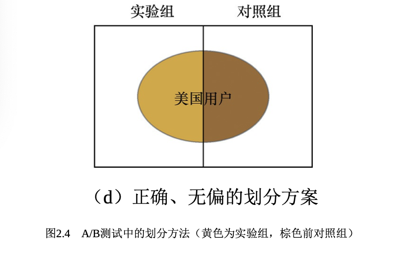

# 模型评估

“没有测量，就没有科学。”这是科学家门捷列夫的名言。在计算机科学特别 是机器学习领域中，对模型的评估同样至关重要。只有选择与问题相匹配的评估 方法，才能快速地发现模型选择或训练过程中出现的问题，迭代地对模型进行优 化。模型评估主要分为离线评估和在线评估两个阶段。针对分类、排序、回归、 序列预测等不同类型的机器学习问题，评估指标的选择也有所不同。知道每种评 估指标的精确定义、有针对性地选择合适的评估指标、根据评估指标的反馈进行 模型调整，这些都是机器学习在模型评估阶段的关键问题，也是一名合格的算法 工程师应当具备的基本功。 

### 评估指标的局限性 

在模型评估过程中，分类问题、排序问题、回归问题往往需要使用不同的指 标进行评估。在诸多的评估指标中，大部分指标只能片面地反映模型的一部分性 能。如果不能合理地运用评估指标，不仅不能发现模型本身的问题，而且会得出 错误的结论。 

1. 准确率的局限性 

分析与解答 

准确率是分类问题中最简单也是最直观的评价指标，但存在明显的缺陷。比 如，当负样本占99%时，分类器把所有样本都预测为负样本也可以获得99%的准确 率。所以，当不同类别的样本比例非常不均衡时，占比大的类别往往成为影响准 确率的最主要因素。 

2. 精确率与召回率的权衡。 

分析与解答 

为了综合评估一个排序模型的好坏，不仅要看模型在不同 Top N下的Precision@N和Recall@N，而且最好绘制出模型的P-R(Precision- Recall)曲线。这里简单介绍一下P-R曲线的绘制方法。 

3. 平方根误差的**“**意外**”**。 

分析与解答 

RMSE经常被用来衡量回归模型的好坏，但按照题目的叙述，RMSE这个指标 

却失效了。先看一下RMSE的计算公式为 
$$
RMSE = \sqrt{\frac{\Sigma_i^{n}(y_i-\hat{y_i})^2}{n}}
$$
其中，$$y_i$$是第*i*个样本点的真实值， 是第*i*个样本点的预测值，*n*是样本点的个数。 

一般情况下，RMSE能够很好地反映回归模型预测值与真实值的偏离程度。但 在实际问题中，如果存在个别偏离程度非常大的离群点(Outlier)时，即使离群点 数量非常少，也会让RMSE指标变得很差。 

### **ROC**曲线 

4. 什么是**ROC**曲线? 

ROC曲线是Receiver Operating Characteristic Curve的简称，中文名为“受试者工 作特征曲线”。ROC曲线源于军事领域，而后在医学领域应用甚广，“受试者工作 特征曲线”这一名称也正是来自于医学领域。 

ROC曲线的横坐标为假阳性率(False Positive Rate，FPR);纵坐标为真阳性 率(True Positive Rate，TPR)。FPR和TPR的计算方法分别为 
$$
FPR = \frac{FP}{N}
$$

$$
TPR = \frac{TP}{P}
$$

上式中，*P*是真实的正样本的数量，*N*是真实的负样本的数量，*TP*是*P*个正样本中 被分类器预测为正样本的个数，*FP*是*N*个负样本中被分类器预测为正样本的个 数。 

只看定义确实有点绕，为了更直观地说明这个问题，我们举一个医院诊断病 人的例子。假设有10位疑似癌症患者，其中有3位很不幸确实患了癌症(*P*=3)， 另外7位不是癌症患者(*N*=7)。医院对这10位疑似患者做了诊断，诊断出3位癌症 患者，其中有2位确实是真正的患者(*TP*=2)。那么真阳性率*TPR*=*TP*/*P*=2/3。对 于7位非癌症患者来说，有一位很不幸被误诊为癌症患者(*FP*=1)，那么假阳性率 *FPR*=*FP*/*N*=1/7。对于“该医院”这个分类器来说，这组分类结果就对应ROC曲线上 的一个点(1/7，2/3)。 

5. 如何绘制**ROC**曲线? 

事实上，ROC曲线是通过不断移动分类器的“截断点”来生成曲线上的一组关 

键点的，通过下面的例子进一步来解释“截断点”的概念。 

在二值分类问题中，模型的输出一般都是预测样本为正例的概率。假设测试 集中有20个样本，表2.1是模型的输出结果。样本按照预测概率从高到低排序。在 输出最终的正例、负例之前，我们需要指定一个阈值，预测概率大于该阈值的样 本会被判为正例，小于该阈值的样本则会被判为负例。比如，指定阈值为0.9，那 么只有第一个样本会被预测为正例，其他全部都是负例。上面所说的“截断点”指 的就是区分正负预测结果的阈值。 

通过动态地调整截断点，从最高的得分开始(实际上是从正无穷开始，对应 着ROC曲线的零点)，逐渐调整到最低得分，每一个截断点都会对应一个*FPR*和 *TPR*，在ROC图上绘制出每个截断点对应的位置，再连接所有点就得到最终的 ROC曲线。 

6. 如何计算**AUC**? 

顾名思义，AUC指的是ROC曲线下的面积大小，该值能够量化地反映基于 ROC曲线衡量出的模型性能。计算AUC值只需要沿着ROC横轴做积分就可以了。 由于ROC曲线一般都处于*y*=*x*这条直线的上方(如果不是的话，只要把模型预测的 概率反转成1−*p*就可以得到一个更好的分类器)，所以AUC的取值一般在0.5~1之 间。AUC越大，说明分类器越可能把真正的正样本排在前面，分类性能越好。 

7. **ROC**曲线相比**P-R**曲线有什么特点? 

本章第一小节曾介绍过同样被经常用来评估分类和排序模型的P-R曲线。相比 P-R曲线，ROC曲线有一个特点，当正负样本的分布发生变化时，ROC曲线的形状 能够基本保持不变，而P-R曲线的形状一般会发生较剧烈的变化。 

> **ROC**曲线的由来 
>
> ROC曲线最早是运用在军事上的，后来逐渐运用到医学领域，并于20世纪80年代后期被引入机器学习领域。相传在第二次 世界大战期间，雷达兵的任务之一就是死死地盯住雷达显示器，观察是否有敌机来袭。理论上讲，只要有敌机来袭，雷达屏幕上 就会出现相应的信号。但是实际上，如果飞鸟出现在雷达扫描区域时，雷达屏幕上有时也会出现信号。这种情况令雷达兵烦恼不 已，如果过于谨慎，凡是有信号就确定为敌机来袭，显然会增加误报风险;如果过于大胆，凡是信号都认为是飞鸟，又会增加漏 报的风险。每个雷达兵都竭尽所能地研究飞鸟信号和飞机信号之间的区别，以便增加预报的准确性。但问题在于，每个雷达兵都 有自己的判别标准，有的雷达兵比较谨慎，容易出现误报;有的雷达兵则比较胆大，容易出现漏报。 
>
> 为了研究每个雷达兵预报的准确性，雷达兵的管理者汇总了所有雷达兵的预报特点，特别是他们漏报和误报的概率，并将 这些概率画到一个二维坐标系里。这个二维坐标的纵坐标为敏感性(真阳性率)，即在所有敌机来袭的事件中，每个雷达兵准确 预报的概率。而横坐标则为1-特异性(假阳性率)，表示在所有非敌机来袭信号中，雷达兵预报错误的概率。由于每个雷达兵的 预报标准不同，且得到的敏感性和特异性的组合也不同。将这些雷达兵的预报性能进行汇总后，雷达兵管理员发现他们刚好在一 条曲线上，这条曲线就是后来被广泛应用在医疗和机器学习领域的ROC曲线。 

### 余弦距离的应用 

在机器学习问题中，通常将特征表示为向量的形式，所以在分析两个特征向 量之间的相似性时，常使用余弦相似度来表示。余弦相似度的取值范围是[−1,1]， 相同的两个向量之间的相似度为1。如果希望得到类似于距离的表示，将1减去余 弦相似度即为余弦距离。因此，余弦距离的取值范围为[0,2]，相同的两个向量余 弦距离为0。 

8. 结合你的学习和研究经历，探讨为什么在一些场景中要使用余弦相似度而不 是欧氏距离? 

对于两个向量*A*和*B*，其余弦相似度定义为 $$cos(A,B)=\frac{A·B}{\left\|A\right\|_2\left\|B\right\|_2}$$即两个向量 夹角的余弦，关注的是向量之间的角度关系，并不关心它们的绝对大小，其取值 范围是[−1,1]。当一对文本相似度的长度差距很大、但内容相近时，如果使用词频 或词向量作为特征，它们在特征空间中的的欧氏距离通常很大;而如果使用余弦 相似度的话，它们之间的夹角可能很小，因而相似度高。此外，在文本、图像、 视频等领域，研究的对象的特征维度往往很高，余弦相似度在高维情况下依然保 持“相同时为1，正交时为0，相反时为−1”的性质，而欧氏距离的数值则受维度的 影响，范围不固定，并且含义也比较模糊。 在一些场景，例如Word2Vec中，其向量的模长是经过归一化的，此时欧氏距 离与余弦距离有着单调的关系，即 
$$
\left\|A-B\right\|_2 = \sqrt{2(1-cos(A,B))} 
$$
其中|| *A*−*B* ||2表示欧氏距离，cos(*A*,*B*)表示余弦相似度，(1−cos(*A*,*B*))表示余弦距 

离。在此场景下，如果选择距离最小(相似度最大)的近邻，那么使用余弦相似 度和欧氏距离的结果是相同的。 

总体来说，欧氏距离体现数值上的绝对差异，而余弦距离体现方向上的相对 差异。例如，统计两部剧的用户观看行为，用户A的观看向量为(0,1)，用户B为 (1,0);此时二者的余弦距离很大，而欧氏距离很小;我们分析两个用户对于不同 视频的偏好，更关注相对差异，显然应当使用余弦距离。而当我们分析用户活跃 度，以登陆次数(单位:次)和平均观看时长(单位:分钟)作为特征时，余弦距离会 认为(1,10)、(10,100)两个用户距离很近;但显然这两个用户活跃度是有着极大差异 的，此时我们更关注数值绝对差异，应当使用欧氏距离 

9. 余弦距离是否是一个严格定义的距离**?** 

余弦距离的定义:在一个集合中，如果每一对元素均可唯一确定一个实数，使得三条 距离公理(正定性，对称性，三角不等式)成立，则该实数可称为这对元素之间 的距离。 

余弦距离满足正定性和对称性，但是不满足三角不等式，因此它并不是严格 定义的距离。具体来说，对于向量*A*和*B*，三条距离公理的证明过程如下。 

* 正定性
* 对称性
* 三角不等式 

### **A/B**测试的陷阱 

在互联网公司中，A/B 测试是验证新模块、新功能、新产品是否有效，新算 法、新模型的效果是否有提升，新设计是否受到用户欢迎，新更改是否影响用户 体验的主要测试方法。在机器学习领域中，A/B 测试是验证模型最终效果的主要 手段。 

10. 在对模型进行过充分的离线评估之后，为什么还要进行在线**A/B**测试? 

需要进行在线A/B测试的原因如下。 

(1)离线评估无法完全消除模型过拟合的影响，因此，得出的离线评估结果 无法完全替代线上评估结果。 

(2)离线评估无法完全还原线上的工程环境。一般来讲，离线评估往往不会 考虑线上环境的延迟、数据丢失、标签数据缺失等情况。因此，离线评估的结果 是理想工程环境下的结果。 

(3)线上系统的某些商业指标在离线评估中无法计算。离线评估一般是针对 模型本身进行评估，而与模型相关的其他指标，特别是商业指标，往往无法直接 获得。比如，上线了新的推荐算法，离线评估往往关注的是ROC曲线、P-R曲线等 的改进，而线上评估可以全面了解该推荐算法带来的用户点击率、留存时长、PV 访问量等的变化。这些都要由A/B测试来进行全面的评估。 

11. 如何进行线上**A/B**测试? 

进行A/B测试的主要手段是进行用户分桶，即将用户分成实验组和对照组，对 实验组的用户施以新模型，对对照组的用户施以旧模型。在分桶的过程中，要注 意样本的独立性和采样方式的无偏性，确保同一个用户每次只能分到同一个桶 中，在分桶过程中所选取的user_id需要是一个随机数，这样才能保证桶中的样本 是无偏的。 

12. 如何划分实验组和对照组 

H公司的算法工程师们最近针对系统中的“美国用户”研发了一套全新的视频推 荐模型*A*，而目前正在使用的针对全体用户的推荐模型是*B*。在正式上线之前，工 程师们希望通过A/B测试来验证新推荐模型的效果。下面有三种实验组和对照组的 划分方法，请指出哪种划分方法是正确的? 

(1)根据user_id(user_id完全随机生成)个位数的奇偶性将用户划分为实验 组和对照组，对实验组施以推荐模型*A*，对照组施以推荐模型*B*; 

(2)将user_id个位数为奇数且为美国用户的作为实验组，其余用户为对照 组; 

(3)将user_id个位数为奇数且为美国用户的作为实验组，user_id个位数为偶 数的用户作为对照组。 

分析与解答 

上述3种A/B测试的划分方法都不正确。我们用包含关系图来说明三种划分方 法，如图2.4所示。方法1(见图2.4(a))没有区分是否为美国用户，实验组和对 照组的实验结果均有稀释;方法2(见图2.4(b))的实验组选取无误，并将其余 所有用户划分为对照组，导致对照组的结果被稀释;方法3(见图2.4(c))的对 照组存在偏差。正确的做法是将所有美国用户根据user_id个位数划分为试验组合 对照组(见图2.4(d))，分别施以模型*A*和*B*，才能够验证模型*A*的效果。 

### 模型评估的方法 

知识点
 Holdout检验，交叉验证，自助法(Bootstrap)，微积分 

13. 在模型评估过程中，有哪些主要的验证方法，它们的优缺点是什么**?** 

**■ Holdout**检验 

Holdout 检验是最简单也是最直接的验证方法，它将原始的样本集合随机划分 成训练集和验证集两部分。比方说，对于一个点击率预测模型，我们把样本按照 70%~30% 的比例分成两部分，70% 的样本用于模型训练;30% 的样本用于模型 验证，包括绘制ROC曲线、计算精确率和召回率等指标来评估模型性能。 

Holdout 检验的缺点很明显，即在验证集上计算出来的最后评估指标与原始分 组有很大关系。为了消除随机性，研究者们引入了“交叉检验”的思想。 

**■** 交叉检验 

k-fold交叉验证:首先将全部样本划分成*k*个大小相等的样本子集;依次遍历 这*k*个子集，每次把当前子集作为验证集，其余所有子集作为训练集，进行模型的 训练和评估;最后把*k*次评估指标的平均值作为最终的评估指标。在实际实验 中，*k*经常取10。 

留一验证:每次留下1个样本作为验证集，其余所有样本作为测试集。样本总 数为*n*，依次对*n*个样本进行遍历，进行*n*次验证，再将评估指标求平均值得到最终 的评估指标。在样本总数较多的情况下，留一验证法的时间开销极大。事实上， 留一验证是留*p*验证的特例。留*p*验证是每次留下*p*个样本作为验证集，而从*n*个元 

素中选择*p*个元素有 种可能，因此它的时间开销更是远远高于留一验证，故而很 少在实际工程中被应用。 

**■** 自助法 

不管是Holdout检验还是交叉检验，都是基于划分训练集和测试集的方法进行 模型评估的。然而，当样本规模比较小时，将样本集进行划分会让训练集进一步 减小，这可能会影响模型训练效果。有没有能维持训练集样本规模的验证方法 呢?自助法可以比较好地解决这个问题。 

自助法是基于自助采样法的检验方法。对于总数为*n*的样本集合，进行*n*次有 放回的随机抽样，得到大小为*n*的训练集。*n*次采样过程中，有的样本会被重复采 样，有的样本没有被抽出过，将这些没有被抽出的样本作为验证集，进行模型验 证，这就是自助法的验证过程。 

14. 在自助法的采样过程中，对**n**个样本进行**n**次自助抽样，当**n**趋于无穷大时， 最终有多少数据从未被选择过? 

### 超参数调优 

为了进行超参数调优，我们一般会采用网格搜索、随机搜索、贝叶斯优化等 算法。在具体介绍算法之前，需要明确超参数搜索算法一般包括哪几个要素。一 是目标函数，即算法需要最大化/最小化的目标;二是搜索范围，一般通过上限和 下限来确定;三是算法的其他参数，如搜索步长。 

15. 超参数有哪些调优方法? 

**■** 网格搜索 

网格搜索可能是最简单、应用最广泛的超参数搜索算法，它通过查找搜索范 围内的所有的点来确定最优值。如果采用较大的搜索范围以及较小的步长，网格 搜索有很大概率找到全局最优值。然而，这种搜索方案十分消耗计算资源和时 间，特别是需要调优的超参数比较多的时候。因此，在实际应用中，网格搜索法 一般会先使用较广的搜索范围和较大的步长，来寻找全局最优值可能的位置;然 后会逐渐缩小搜索范围和步长，来寻找更精确的最优值。这种操作方案可以降低 所需的时间和计算量，但由于目标函数一般是非凸的，所以很可能会错过全局最 优值。 

**■** 随机搜索 

随机搜索的思想与网格搜索比较相似，只是不再测试上界和下界之间的所有 值，而是在搜索范围中随机选取样本点。它的理论依据是，如果样本点集足够 大，那么通过随机采样也能大概率地找到全局最优值，或其近似值。随机搜索一 般会比网格搜索要快一些，但是和网格搜索的快速版一样，它的结果也是没法保 证的。 

**■** 贝叶斯优化算法 

贝叶斯优化算法在寻找最优最值参数时，采用了与网格搜索、随机搜索完全 不同的方法。网格搜索和随机搜索在测试一个新点时，会忽略前一个点的信息; 而贝叶斯优化算法则充分利用了之前的信息。贝叶斯优化算法通过对目标函数形 状进行学习，找到使目标函数向全局最优值提升的参数。具体来说，它学习目标 函数形状的方法是，首先根据先验分布，假设一个搜集函数;然后，每一次使用 新的采样点来测试目标函数时，利用这个信息来更新目标函数的先验分布;最 后，算法测试由后验分布给出的全局最值最可能出现的位置的点。对于贝叶斯优 化算法，有一个需要注意的地方，一旦找到了一个局部最优值，它会在该区域不 断采样，所以很容易陷入局部最优值。为了弥补这个缺陷，贝叶斯优化算法会在 探索和利用之间找到一个平衡点，“探索”就是在还未取样的区域获取采样点; 而“利用”则是根据后验分布在最可能出现全局最值的区域进行采样。 

### 过拟合与欠拟合 

16. 在模型评估过程中，过拟合和欠拟合具体是指什么现象? 

过拟合是指模型对于训练数据拟合呈过当的情况，反映到评估指标上，就是 模型在训练集上的表现很好，但在测试集和新数据上的表现较差。欠拟合指的是 模型在训练和预测时表现都不好的情况。图2.5形象地描述了过拟合和欠拟合的区 别。 

17. 能否说出几种降低过拟合和欠拟合风险的方法? 

**■** 降低**“**过拟合**”**风险的方法 

(1)从数据入手，获得更多的训练数据。使用更多的训练数据是解决过拟合 问题最有效的手段，因为更多的样本能够让模型学习到更多更有效的特征，减小 噪声的影响。当然，直接增加实验数据一般是很困难的，但是可以通过一定的规 则来扩充训练数据。比如，在图像分类的问题上，可以通过图像的平移、旋转、 缩放等方式扩充数据;更进一步地，可以使用生成式对抗网络来合成大量的新训 练数据。 

(2)降低模型复杂度。在数据较少时，模型过于复杂是产生过拟合的主要因 素，适当降低模型复杂度可以避免模型拟合过多的采样噪声。例如，在神经网络 模型中减少网络层数、神经元个数等;在决策树模型中降低树的深度、进行剪枝 等。 

(3)正则化方法。给模型的参数加上一定的正则约束，比如将权值的大小加 入到损失函数中。以L2正则化为例: 
$$
C = C_0 + \frac{\lambda}{2n}·\Sigma_i{w_i^2}
$$
这样，在优化原来的目标函数$$C_0$$的同时，也能避免权值过大带来的过拟合风险。 

(4)集成学习方法。集成学习是把多个模型集成在一起，来降低单一模型的 过拟合风险，如Bagging方法。 

**■** 降低**“**欠拟合**”**风险的方法 

(1)添加新特征。当特征不足或者现有特征与样本标签的相关性不强时，模 型容易出现欠拟合。通过挖掘“上下文特征”“ID类特征”“组合特征”等新的特征，往 往能够取得更好的效果。在深度学习潮流中，有很多模型可以帮助完成特征工 程，如因子分解机、梯度提升决策树、Deep-crossing等都可以成为丰富特征的方 法。 

(2)增加模型复杂度。简单模型的学习能力较差，通过增加模型的复杂度可 以使模型拥有更强的拟合能力。例如，在线性模型中添加高次项，在神经网络模 型中增加网络层数或神经元个数等。 

(3)减小正则化系数。正则化是用来防止过拟合的，但当模型出现欠拟合现 象时，则需要有针对性地减小正则化系数。 