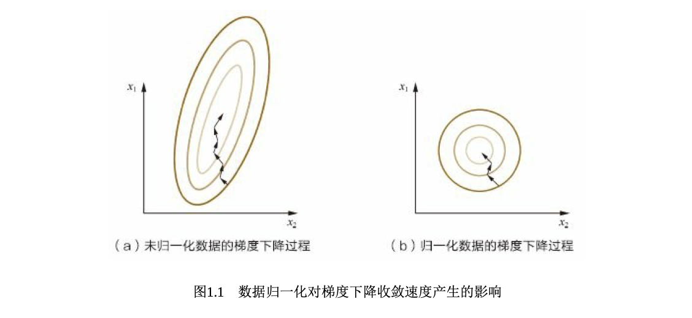

# 特征工程

* 特征构造
* 特征选择
* 特征降维

俗话说，“巧妇难为无米之炊”。在机器学习中，数据和特征便是“米”，模型和 算法则是“巧妇”。没有充足的数据、合适的特征，再强大的模型结构也无法得到 满意的输出。正如一句业界经典的话所说，“Garbage in，garbage out”。对于一个 机器学习问题，数据和特征往往决定了结果的上限，而模型、算法的选择及优化 则是在逐步接近这个上限。 

特征工程，顾名思义，是对原始数据进行一系列工程处理，将其提炼为特 征，作为输入供算法和模型使用。从本质上来讲，特征工程是一个表示和展现数 据的过程。在实际工作中，特征工程旨在去除原始数据中的杂质和冗余，设计更 高效的特征以刻画求解的问题与预测模型之间的关系。 

本章主要讨论以下两种常用的数据类型。 

(1)结构化数据。结构化数据类型可以看作关系型数据库的一张表，每列都 有清晰的定义，包含了数值型、类别型两种基本类型;每一行数据表示一个样本 的信息。 

(2)非结构化数据。非结构化数据主要包括文本、图像、音频、视频数据， 其包含的信息无法用一个简单的数值表示，也没有清晰的类别定义，并且每条数 据的大小各不相同。 

### 特征归一化 

为了消除数据特征之间的量纲影响，我们需要对特征进行归一化处理，使得 不同指标之间具有可比性。 

#### 问题 

1. 为什么需要对数值类型的特征做归一化? 

   分析与解答 

   对数值类型的特征做归一化可以将所有的特征都统一到一个大致相同的数值 区间内。最常用的方法主要有以下两种。 

   

(1)线性函数归一化(Min-Max Scaling)。它对原始数据进行线性变换，使 结果映射到[0, 1]的范围，实现对原始数据的等比缩放。归一化公式如下 

​	
$$
X_{norm} = \frac{X - \overline{X}}{X_{max} - X_{min}}
$$
其中*X*为原始数据， $$X_{max}$$ $$X_{min}$$ 分别为数据最大值和最小值。 

​	

(2)零均值归一化(Z-Score Normalization)。它会将原始数据映射到均值为 0、标准差为1的分布上。具体来说，假设原始特征的均值为*μ*、标准差为*σ*，那么 归一化公式定义为 
$$
z = \frac{x - \mu}{\sigma}
$$
在学习速率相同的情况下，$$x_1$$的更新速度会大于$$X_2$$，需要较多的迭代才能找到 最优解。如果将$$X_1$$和$$X_2$$归一化到相同的数值区间后，优化目标的等值图会变成图 1.1(b)中的圆形，$$X_1$$和$$X_2$$的更新速度变得更为一致，容易更快地通过梯度下降找 到最优解 .

在实际应用中，通过梯度下降法求解的模 型通常是需要归一化的，包括线性回归、逻辑回归、支持向量机、神经网络等模 型。但对于决策树模型则并不适用 

### 类别型特征 

2. 在对数据进行预处理时，应该怎样处理类别型特征? 

   分析与解答 

   ​	**■** 序号编码 

   序号编码通常用于处理类别间具有大小关系的数据。例如成绩，可以分为 低、中、高三档，并且存在“高>中>低”的排序关系。序号编码会按照大小关系对 类别型特征赋予一个数值ID，例如高表示为3、中表示为2、低表示为1，转换后依 然保留了大小关系。 

   ​	**■** 独热编码 

   独热编码通常用于处理类别间不具有大小关系的特征。例如血型，一共有4个 取值(A型血、B型血、AB型血、O型血)，独热编码会把血型变成一个4维稀疏 向量，A型血表示为(1, 0, 0, 0)，B型血表示为(0, 1, 0, 0)，AB型表示为(0, 0, 1, 0)，O型血表示为(0, 0, 0, 1)。对于类别取值较多的情况下使用独热编码需要 注意以下问题。 

   ​	(1)使用稀疏向量来节省空间。在独热编码下，特征向量只有某一维取值为 1，其他位置取值均为0。因此可以利用向量的稀疏表示有效地节省空间，并且目前大部分的算法均接受稀疏向量形式的输入。 

   (2)配合特征选择来降低维度。高维度特征会带来几方面的问题。一是在K 近邻算法中，高维空间下两点之间的距离很难得到有效的衡量;二是在逻辑回归 模型中，参数的数量会随着维度的增高而增加，容易引起过拟合问题;三是通常 只有部分维度是对分类、预测有帮助，因此可以考虑配合特征选择来降低维度。 

   ​	**■** 二进制编码 

   二进制编码主要分为两步，先用序号编码给每个类别赋予一个类别ID，然后 将类别ID对应的二进制编码作为结果。以A、B、AB、O血型为例，表1.1是二进制 编码的过程。A型血的ID为1，二进制表示为001;B型血的ID为2，二进制表示为 010;以此类推可以得到AB型血和O型血的二进制表示。可以看出，二进制编码本 质上是利用二进制对ID进行哈希映射，最终得到0/1特征向量，且维数少于独热编 码，节省了存储空间 

	

除了本章介绍的编码方法外，有兴趣的读者还可以进一步了解其他的编码方 式，比如Helmert Contrast、Sum Contrast、Polynomial Contrast、Backward Difference Contrast等 

### 高维组合特征的处理 

3. 什么是组合特征?如何处理高维组合特征? 

分析与解答 

​	为了提高复杂关系的拟合能力，在特征工程中经常会把一阶离散特征两两组 合，构成高阶组合特征。 

### 组合特征 

​	上一节介绍了如何利用降维方法来减少两个高维特征组合后需要学习的参 数。但是在很多实际问题中，我们常常需要面对多种高维特征。如果简单地两两 组合，依然容易存在参数过多、过拟合等问题，而且并不是所有的特征组合都是 有意义的。因此，需要一种有效的方法来帮助我们找到应该对哪些特征进行组 合。 

4. 怎样有效地找到组合特征? 

   本节介绍一种基于决策树的特征组合寻找方法[1](关于决策树的详细内容可见 第3章第3节)。以点击预测问题为例，假设原始输入特征包含年龄、性别、用户 类型(试用期、付费)、物品类型(护肤、食品等)4个方面的信息，并且根据原 始输入和标签(点击/未点击)构造出了决策树，如图1.2所示。 

### 文本表示模型 

5. 有哪些文本表示模型?它们各有什么优缺点? 

分析与解答 

**■** 词袋模型和**N-gram**模型 

最基础的文本表示模型是词袋模型。顾名思义，就是将每篇文章看成一袋子 词，并忽略每个词出现的顺序。具体地说，就是将整段文本以词为单位切分开， 然后每篇文章可以表示成一个长向量，向量中的每一维代表一个单词，而该维对 应的权重则反映了这个词在原文章中的重要程度。常用TF-IDF来计算权重，公式 为 
$$
TF-IDF(t,d)=TF(t,d)×IDF(t) 
$$
 

**■** 主题模型 主题模型用于从文本库中发现有代表性的主题(得到每个主题上面词的分布 

特性)，并且能够计算出每篇文章的主题分布，具体细节参见第6章第5节。 

**■** 词嵌入与深度学习模型 

词嵌入是一类将词向量化的模型的统称，核心思想是将每个词都映射成低维 空间(通常*K*=50~300维)上的一个稠密向量(Dense Vector)。*K*维空间的每一 维也可以看作一个隐含的主题，只不过不像主题模型中的主题那样直观。 

### **Word2Vec** 

谷歌2013年提出的Word2Vec是目前最常用的词嵌入模型之一。Word2Vec实际 是一种浅层的神经网络模型，它有两种网络结构，分别是CBOW(Continues Bag of Words)和Skip-gram。 

6. **Word2Vec**是如何工作的?它和**LDA**有什么区别与联系? 

CBOW的目标是根据上下文出现的词语来预测当前词的生成概率，如图 1.3(a)所示;而Skip-gram是根据当前词来预测上下文中各词的生成概率，如图 1.3(b)所示。 

谈到Word2Vec与LDA的区别和联系，首先，LDA是利用文档中单词的共现关 系来对单词按主题聚类，也可以理解为对“文档-单词”矩阵进行分解，得到“文档- 主题”和“主题-单词”两个概率分布。而Word2Vec其实是对“上下文-单词”矩阵进行 学习，其中上下文由周围的几个单词组成，由此得到的词向量表示更多地融入了 上下文共现的特征。也就是说，如果两个单词所对应的Word2Vec向量相似度较 高，那么它们很可能经常在同样的上下文中出现。需要说明的是，上述分析的是 LDA与Word2Vec的不同，不应该作为主题模型和词嵌入两类方法的主要差异。主 题模型通过一定的结构调整可以基于“上下文-单词”矩阵进行主题推理。同样地， 词嵌入方法也可以根据“文档-单词”矩阵学习出词的隐含向量表示。主题模型和词 嵌入两类方法最大的不同其实在于模型本身，主题模型是一种基于概率图模型的 生成式模型，其似然函数可以写成若干条件概率连乘的形式，其中包括需要推测 的隐含变量(即主题);而词嵌入模型一般表达为神经网络的形式，似然函数定 义在网络的输出之上，需要通过学习网络的权重以得到单词的稠密向量表示。 

### 图像数据不足时的处理方法 

7. 在图像分类任务中，训练数据不足会带来什么问题?如何缓解数据量不足带 来的问题? 

分析与解答 

一个模型所能提供的信息一般来源于两个方面，一是训练数据中蕴含的信 息;二是在模型的形成过程中(包括构造、学习、推理等)，人们提供的先验信 息。当训练数据不足时，说明模型从原始数据中获取的信息比较少，这种情况下 要想保证模型的效果，就需要更多先验信息。先验信息可以作用在模型上，例如 让模型采用特定的内在结构、条件假设或添加其他一些约束条件;先验信息也可 以直接施加在数据集上，即根据特定的先验假设去调整、变换或扩展训练数据， 让其展现出更多的、更有用的信息，以利于后续模型的训练和学习。 

具体到图像分类任务上，训练数据不足带来的问题主要表现在过拟合方面， 即模型在训练样本上的效果可能不错，但在测试集上的泛化效果不佳。根据上述 讨论，对应的处理方法大致也可以分两类，一是基于模型的方法，主要是采用降 低过拟合风险的措施，包括简化模型(如将非线性模型简化为线性模型)、添加 约束项以缩小假设空间(如L1/L2正则项)、集成学习、Dropout超参数等;二是基 于数据的方法，主要通过数据扩充(Data Augmentation)，即根据一些先验知 识，在保持特定信息的前提下，对原始数据进行适当变换以达到扩充数据集的效 果。具体到图像分类任务中，在保持图像类别不变的前提下，可以对训练集中的 每幅图像进行以下变换。 

(1)一定程度内的随机旋转、平移、缩放、裁剪、填充、左右翻转等，这些 变换对应着同一个目标在不同角度的观察结果。 

(2)对图像中的像素添加噪声扰动，比如椒盐噪声、高斯白噪声等。 

(3)颜色变换。例如，在图像的RGB颜色空间上进行主成分分析，得到3个 

主成分的特征向量$$p_1$$,$$p_2$$,$$p_3$$及其对应的特征值 ，然后$$\lambda_1$$,$$\lambda_2$$,$$\lambda_3$$在每个像素的RGB值上 添加增量[*p* ,*p* ,*p* ]•[*α λ* ,*α λ* ,*α λ* ]T，其中 *α* ,*α* ,*α* 是均值为0、方差较小的高斯分布随 

*123 112233 123* 

机数。

 (4)改变图像的亮度、清晰度、对比度、锐度等。 

